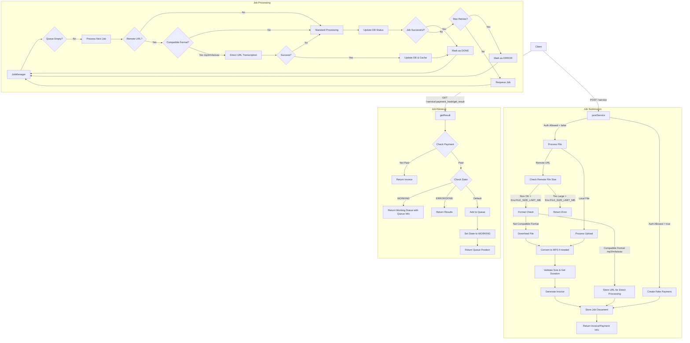

```mermaid
flowchart TD
    A[Client] -->|POST /:service| B[postService]
    
    subgraph "Job Submission"
        B -->|Auth Allowed = true| C[Create Fake Payment]
        B -->|Auth Allowed = false| D[Process File]
        D -->|Local File| E[Process Upload]
        D -->|Remote URL| F1[Check Remote File Size]
        F1 -->|Size OK < Env.FILE_SIZE_LIMIT_MB| F2[Format Check]
        F1 -->|Too Large > Env.FILE_SIZE_LIMIT_MB| F3[Return Error]
        F2 -->|Compatible Format mp3/m4a/wav| F2A[Store URL for Direct Processing]
        F2 -->|Not Compatible Format| F2B[Download File]
        F2B --> G[Convert to MP3 if needed]
        E --> G
        G --> H[Validate Size & Get Duration]
        H --> I[Generate Invoice]
        I --> J[Store Job Document]
        F2A --> J
        C --> J
        J --> K[Return Invoice/Payment Info]
    end
    
    A -->|GET /:service/:payment_hash/get_result| L[getResult]
    
    subgraph "Job Retrieval"
        L --> M{Check Payment}
        M -->|Not Paid| N[Return Invoice]
        M -->|Paid| O{Check State}
        O -->|WORKING| P[Return Working Status with Queue Info]
        O -->|ERROR/DONE| Q[Return Results]
        O -->|Default| R[Add to Queue]
        R --> S[Set State to WORKING]
        S --> T[Return Queue Position]
    end
    
    subgraph "Job Processing"
        U[JobManager] --> V{Queue Empty?}
        V -->|No| W[Process Next Job]
        W --> W1{Remote URL?}
        W1 -->|No| W2[Standard Processing]
        W1 -->|Yes| W3{Compatible Format?}
        W3 -->|No| W2
        W3 -->|Yes mp3/m4a/wav| W4[Direct URL Transcription]
        W4 --> W5{Success?}
        W5 -->|No| W2
        W5 -->|Yes| W6[Update DB & Cache]
        W2 --> X[Update DB Status]
        W6 --> Z
        X --> Y{Job Successful?}
        Y -->|Yes| Z[Mark as DONE]
        Y -->|No| AA{Max Retries?}
        AA -->|Yes| AB[Mark as ERROR]
        AA -->|No| AC[Requeue Job]
        Z --> U
        AB --> U
        AC --> U
    end
``` 